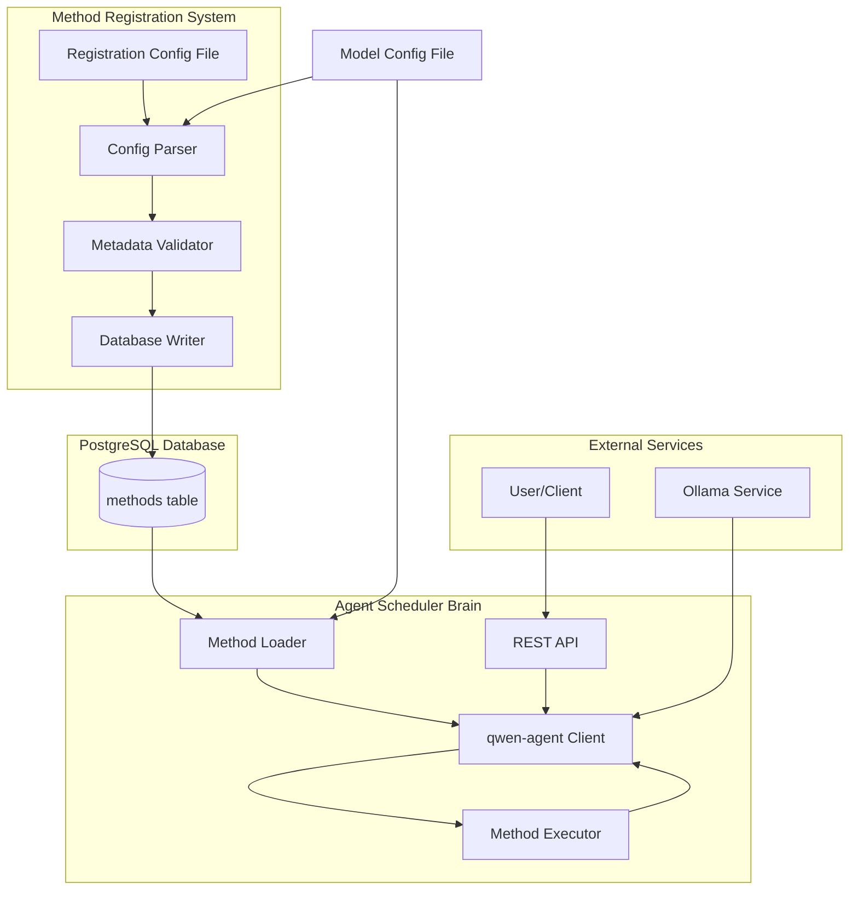

# Design Document

## Overview

本设计文档描述了基于qwen-agent框架的智能体调度系统的技术架构和实现方案。系统由两个独立但协作的项目组成：

1. **Method Registration System (方法注册系统)** - 一个命令行工具，负责读取配置文件、验证方法元数据并将其持久化到PostgreSQL数据库
2. **Agent Scheduler Brain (智能体调度大脑)** - 一个服务端应用，提供RESTful API接口，使用qwen-agent框架从数据库加载方法并执行智能体任务调度

系统采用Python语言实现，使用Ollama部署的qwen3:4b模型作为底层大语言模型。

## Architecture

### 系统架构图



### 项目结构


```
qwen-agent-scheduler/
├── method-registration/          # 方法注册系统
│   ├── config/
│   │   ├── model_config.yaml    # 模型配置
│   │   └── methods.yaml         # 方法注册配置
│   ├── src/
│   │   ├── __init__.py
│   │   ├── config_parser.py     # 配置文件解析器
│   │   ├── validator.py         # 元数据验证器
│   │   ├── db_client.py         # 数据库客户端
│   │   └── main.py              # 主入口
│   ├── tests/
│   │   ├── test_config_parser.py
│   │   ├── test_validator.py
│   │   └── test_db_client.py
│   └── requirements.txt
│
├── agent-scheduler/              # 智能体调度大脑
│   ├── config/
│   │   └── model_config.yaml    # 模型配置
│   ├── src/
│   │   ├── __init__.py
│   │   ├── method_loader.py     # 方法加载器
│   │   ├── agent_client.py      # qwen-agent客户端
│   │   ├── executor.py          # 方法执行引擎
│   │   ├── api.py               # REST API
│   │   └── main.py              # 主入口
│   ├── tests/
│   │   ├── test_method_loader.py
│   │   ├── test_agent_client.py
│   │   └── test_executor.py
│   └── requirements.txt
│
└── shared/                       # 共享模块
    ├── __init__.py
    ├── models.py                 # 数据模型
    ├── db_schema.py              # 数据库Schema
    └── config_loader.py          # 配置加载器
```

## Components and Interfaces

### 1. Method Registration System Components

#### 1.1 Config Parser (配置解析器)

**职责**: 读取和解析YAML/JSON格式的配置文件

**接口**:
```python
class ConfigParser:
    def load_model_config(self, config_path: str) -> ModelConfig:
        """加载模型配置"""
        pass
    
    def load_methods_config(self, config_path: str) -> List[MethodConfig]:
        """加载方法注册配置"""
        pass
```


#### 1.2 Metadata Validator (元数据验证器)

**职责**: 验证方法元数据的完整性和正确性

**接口**:
```python
class MetadataValidator:
    def validate_method(self, method: MethodConfig) -> ValidationResult:
        """验证单个方法配置"""
        pass
    
    def validate_methods(self, methods: List[MethodConfig]) -> List[ValidationResult]:
        """批量验证方法配置"""
        pass
```

**验证规则**:
- 方法名称: 必须符合Python标识符规范，长度2-100字符
- 参数定义: 每个参数必须包含name、type、description字段
- 返回值类型: 必须是有效的Python类型字符串
- 描述信息: 不能为空，长度不超过1000字符

#### 1.3 Database Writer (数据库写入器)

**职责**: 将验证通过的方法元数据写入PostgreSQL数据库

**接口**:
```python
class DatabaseWriter:
    def __init__(self, db_config: DatabaseConfig):
        pass
    
    def ensure_schema(self) -> None:
        """确保数据库表结构存在"""
        pass
    
    def upsert_method(self, method: MethodMetadata) -> None:
        """插入或更新方法记录"""
        pass
    
    def upsert_methods(self, methods: List[MethodMetadata]) -> None:
        """批量插入或更新方法记录"""
        pass
```

### 2. Agent Scheduler Brain Components

#### 2.1 Method Loader (方法加载器)

**职责**: 从PostgreSQL数据库加载已注册的方法元数据

**接口**:
```python
class MethodLoader:
    def __init__(self, db_config: DatabaseConfig):
        pass
    
    def load_all_methods(self) -> List[MethodMetadata]:
        """加载所有已注册的方法"""
        pass
    
    def load_method_by_name(self, method_name: str) -> Optional[MethodMetadata]:
        """根据名称加载特定方法"""
        pass
    
    def convert_to_qwen_tools(self, methods: List[MethodMetadata]) -> List[Dict]:
        """将方法元数据转换为qwen-agent工具定义格式"""
        pass
```


#### 2.2 Agent Client (qwen-agent客户端)

**职责**: 封装qwen-agent框架的调用逻辑

**接口**:
```python
class AgentClient:
    def __init__(self, model_config: ModelConfig, tools: List[Dict]):
        """初始化qwen-agent客户端"""
        pass
    
    def process_task(self, task_description: str) -> AgentResponse:
        """处理用户任务请求"""
        pass
    
    def register_tool_executor(self, executor: MethodExecutor) -> None:
        """注册方法执行器"""
        pass
```

#### 2.3 Method Executor (方法执行引擎)

**职责**: 动态执行已注册的方法

**接口**:
```python
class MethodExecutor:
    def __init__(self, methods: Dict[str, MethodMetadata]):
        pass
    
    def execute(self, method_name: str, params: Dict[str, Any]) -> ExecutionResult:
        """执行指定的方法"""
        pass
    
    def validate_params(self, method_name: str, params: Dict[str, Any]) -> bool:
        """验证方法参数"""
        pass
```

**执行策略**:
- 使用Python的`importlib`动态导入方法所在模块
- 使用反射机制调用方法
- 支持超时控制（默认30秒）
- 异常捕获和格式化

#### 2.4 REST API (RESTful接口)

**职责**: 提供HTTP接口供客户端调用

**接口定义**:
```python
# POST /api/tasks
# 提交新任务
{
    "task_description": "帮我查询今天的天气"
}
# Response:
{
    "task_id": "uuid",
    "status": "pending"
}

# GET /api/tasks/{task_id}
# 查询任务状态
# Response:
{
    "task_id": "uuid",
    "status": "completed",
    "result": {...},
    "created_at": "2025-12-17T10:00:00Z",
    "completed_at": "2025-12-17T10:00:05Z"
}

# GET /api/methods
# 查询已注册的方法列表
# Response:
{
    "methods": [
        {
            "name": "get_weather",
            "description": "获取天气信息",
            "parameters": [...]
        }
    ]
}
```


## Data Models

### ModelConfig (模型配置)

```python
@dataclass
class ModelConfig:
    model_name: str              # 模型名称，如 "qwen3:4b"
    api_base: str                # Ollama API端点，如 "http://localhost:11434"
    timeout: int = 30            # 请求超时时间（秒）
    temperature: float = 0.7     # 生成温度
    max_tokens: int = 2000       # 最大生成token数
```

### MethodConfig (方法配置)

```python
@dataclass
class MethodParameter:
    name: str                    # 参数名称
    type: str                    # 参数类型（如 "string", "int", "float"）
    description: str             # 参数描述
    required: bool = True        # 是否必需
    default: Any = None          # 默认值

@dataclass
class MethodConfig:
    name: str                    # 方法名称
    description: str             # 方法描述
    parameters: List[MethodParameter]  # 参数列表
    return_type: str             # 返回值类型
    module_path: str             # 方法所在模块路径
    function_name: str           # 函数名称
```

### MethodMetadata (数据库存储的方法元数据)

```python
@dataclass
class MethodMetadata:
    id: Optional[int]            # 数据库主键
    name: str                    # 方法名称
    description: str             # 方法描述
    parameters_json: str         # JSON格式的参数列表
    return_type: str             # 返回值类型
    module_path: str             # 模块路径
    function_name: str           # 函数名称
    created_at: datetime         # 创建时间
    updated_at: datetime         # 更新时间
    
    @property
    def parameters(self) -> List[MethodParameter]:
        """反序列化参数列表"""
        return json.loads(self.parameters_json)
```

### DatabaseConfig (数据库配置)

```python
@dataclass
class DatabaseConfig:
    host: str                    # 数据库主机
    port: int                    # 数据库端口
    database: str                # 数据库名称
    user: str                    # 用户名
    password: str                # 密码
    pool_size: int = 5           # 连接池大小
```

### ExecutionResult (方法执行结果)

```python
@dataclass
class ExecutionResult:
    success: bool                # 是否成功
    result: Any                  # 返回值
    error: Optional[str]         # 错误信息
    execution_time: float        # 执行时间（秒）
```


### Database Schema

```sql
CREATE TABLE IF NOT EXISTS registered_methods (
    id SERIAL PRIMARY KEY,
    name VARCHAR(100) UNIQUE NOT NULL,
    description TEXT NOT NULL,
    parameters_json JSONB NOT NULL,
    return_type VARCHAR(50) NOT NULL,
    module_path VARCHAR(255) NOT NULL,
    function_name VARCHAR(100) NOT NULL,
    created_at TIMESTAMP DEFAULT CURRENT_TIMESTAMP,
    updated_at TIMESTAMP DEFAULT CURRENT_TIMESTAMP
);

-- 创建索引以提高查询性能
CREATE INDEX IF NOT EXISTS idx_method_name ON registered_methods(name);
CREATE INDEX IF NOT EXISTS idx_updated_at ON registered_methods(updated_at);

-- 创建触发器自动更新updated_at字段
CREATE OR REPLACE FUNCTION update_updated_at_column()
RETURNS TRIGGER AS $$
BEGIN
    NEW.updated_at = CURRENT_TIMESTAMP;
    RETURN NEW;
END;
$$ language 'plpgsql';

CREATE TRIGGER update_registered_methods_updated_at 
    BEFORE UPDATE ON registered_methods 
    FOR EACH ROW 
    EXECUTE FUNCTION update_updated_at_column();
```

## Configuration Files

### model_config.yaml (模型配置文件)

```yaml
model:
  name: "qwen3:4b"
  api_base: "http://localhost:11434"
  timeout: 30
  temperature: 0.7
  max_tokens: 2000

database:
  host: "localhost"
  port: 5432
  database: "test_db"
  user: "yuanyuan"
  password: "666666"
  pool_size: 5

logging:
  level: "INFO"
  format: "%(asctime)s - %(name)s - %(levelname)s - %(message)s"
  file: "logs/app.log"
```

### methods.yaml (方法注册配置文件示例)

```yaml
methods:
  - name: "get_weather"
    description: "获取指定城市的天气信息"
    module_path: "tools.weather"
    function_name: "get_weather"
    parameters:
      - name: "city"
        type: "string"
        description: "城市名称"
        required: true
      - name: "unit"
        type: "string"
        description: "温度单位，celsius或fahrenheit"
        required: false
        default: "celsius"
    return_type: "dict"
  
  - name: "calculate"
    description: "执行数学计算"
    module_path: "tools.calculator"
    function_name: "calculate"
    parameters:
      - name: "expression"
        type: "string"
        description: "数学表达式"
        required: true
    return_type: "float"
```


## Correctness Properties

*A property is a characteristic or behavior that should hold true across all valid executions of a system-essentially, a formal statement about what the system should do. Properties serve as the bridge between human-readable specifications and machine-verifiable correctness guarantees.*

### Property 1: Configuration loading consistency

*For any* valid model configuration file, when the system loads the configuration, the resulting ModelConfig object should contain values that exactly match the file contents
**Validates: Requirements 1.1, 1.2**

### Property 2: Configuration parameter propagation

*For any* valid ModelConfig with specific model_name, api_base, and timeout values, when initializing the qwen-agent client, the client should be configured with those exact parameter values
**Validates: Requirements 1.3**

### Property 3: Invalid configuration rejection

*For any* configuration file that is malformed or missing required fields, the system should raise an exception with an error message that identifies the specific problem
**Validates: Requirements 1.4**

### Property 4: Configuration format equivalence

*For any* method definition, when expressed in both JSON and YAML formats with identical content, parsing both formats should produce equivalent MethodConfig objects
**Validates: Requirements 2.1**

### Property 5: Method metadata completeness

*For any* valid method configuration, after parsing, the resulting MethodConfig should contain all required fields: name, description, parameters, return_type, module_path, and function_name
**Validates: Requirements 2.2**

### Property 6: Batch processing completeness

*For any* list of N valid method configurations, after processing, exactly N methods should be registered in the system
**Validates: Requirements 2.3**

### Property 7: Missing field detection

*For any* method configuration missing one or more required fields, validation should fail and the error report should explicitly name each missing field
**Validates: Requirements 2.4**

### Property 8: Duplicate method name detection

*For any* configuration containing two or more methods with the same name, the system should detect the conflict and report an error identifying the duplicate name
**Validates: Requirements 2.5**

### Property 9: Method name validation

*For any* string that does not conform to Python identifier rules (contains spaces, starts with digit, contains special characters), validation should reject it as an invalid method name
**Validates: Requirements 3.1**

### Property 10: Parameter completeness validation

*For any* method with a parameter list, each parameter should have non-empty name, type, and description fields, otherwise validation should fail
**Validates: Requirements 3.2**

### Property 11: Return type validation

*For any* method with a return_type that is not a recognized Python type string, validation should fail with an error indicating the invalid type
**Validates: Requirements 3.3**

### Property 12: Validation error detail

*For any* validation failure, the error report should include both the field name that failed validation and a description of why it failed
**Validates: Requirements 3.4**

### Property 13: Database persistence round-trip

*For any* valid MethodMetadata, after inserting it into the database and then querying by method name, the retrieved record should contain the same name, description, parameters, return_type, module_path, and function_name
**Validates: Requirements 4.3**

### Property 14: Upsert idempotence

*For any* method, inserting it multiple times with the same name should result in exactly one database record, with the content matching the most recent insert
**Validates: Requirements 4.4**

### Property 15: Updated timestamp automation

*For any* existing method record, when any field is updated, the updated_at timestamp should be greater than its previous value
**Validates: Requirements 5.5**

### Property 16: Method loading completeness

*For any* set of N methods stored in the database, when Agent Scheduler Brain starts and loads methods, it should load exactly N methods
**Validates: Requirements 6.1**

### Property 17: JSON deserialization correctness

*For any* method stored in the database with parameters serialized as JSON, after loading and deserializing, the parameters list should match the original parameters that were serialized
**Validates: Requirements 6.2**

### Property 18: qwen-agent tool format conversion

*For any* MethodMetadata, after converting to qwen-agent tool format, the resulting dictionary should contain required keys: 'name', 'description', and 'parameters' in the format expected by qwen-agent
**Validates: Requirements 6.3**

### Property 19: Agent client initialization

*For any* valid ModelConfig, creating an AgentClient with that configuration should succeed without raising exceptions
**Validates: Requirements 7.1**

### Property 20: Method lookup by name

*For any* method name that exists in the loaded methods, querying for that method should return the corresponding MethodMetadata
**Validates: Requirements 7.3**

### Property 21: Method execution with valid parameters

*For any* registered method and valid parameters matching its parameter specification, executing the method should return an ExecutionResult with success=True
**Validates: Requirements 8.1, 8.3**

### Property 22: Type coercion or error

*For any* method call where parameter types don't match the specification, the executor should either successfully coerce the types or return an ExecutionResult with success=False and a clear error message
**Validates: Requirements 8.2**

### Property 23: Exception handling

*For any* method that raises an exception during execution, the executor should return an ExecutionResult with success=False and error field containing the exception information
**Validates: Requirements 8.4**

### Property 24: Test data cleanup

*For any* test that creates data in the database, after the test completes, all created data should be removed from the database
**Validates: Requirements 9.5**

### Property 25: Error logging completeness

*For any* error that occurs in the system, the logged error should include timestamp, error type, error message, and stack trace
**Validates: Requirements 10.1**

### Property 26: Configuration error logging detail

*For any* configuration loading failure, the error log should include the configuration file path and the specific parsing error
**Validates: Requirements 10.2**

### Property 27: Database error logging detail

*For any* database operation failure, the error log should include the SQL statement (if applicable) and the database error code
**Validates: Requirements 10.3**

### Property 28: Method execution error logging detail

*For any* method execution failure, the error log should include the method name, input parameters, and exception information
**Validates: Requirements 10.4**

### Property 29: Debug logging verbosity

*For any* system operation when log level is set to DEBUG, the number of log entries should be greater than when log level is set to INFO
**Validates: Requirements 10.5**

### Property 30: Hot reload configuration refresh

*For any* valid new configuration file, when hot reload is triggered, the system should load the new configuration and subsequent operations should use the new configuration values
**Validates: Requirements 11.1, 11.3**

### Property 31: Hot reload failure safety

*For any* invalid new configuration, when hot reload is attempted, the system should keep the current configuration unchanged and continue operating normally
**Validates: Requirements 11.4**

### Property 32: Hot reload database update

*For any* valid new method configuration loaded via hot reload, the database should be updated to reflect the new method definitions
**Validates: Requirements 11.5**

### Property 33: Task submission response

*For any* valid task description submitted via POST to /api/tasks, the response should include a task_id and status field
**Validates: Requirements 12.2**

### Property 34: Task status query

*For any* task_id returned from task submission, querying GET /api/tasks/{task_id} should return a response containing that task_id and a status field
**Validates: Requirements 12.3**

### Property 35: Invalid request error response

*For any* malformed request to the API, the response should have HTTP status code 400 and include error details in the response body
**Validates: Requirements 12.4**

### Property 36: Server error response

*For any* request that triggers a server-side exception, the response should have HTTP status code 500 and the error should be logged
**Validates: Requirements 12.5**


## Error Handling

### Error Categories

1. **Configuration Errors**
   - Invalid YAML/JSON syntax
   - Missing required configuration fields
   - Invalid data types in configuration
   - File not found errors

2. **Validation Errors**
   - Invalid method names
   - Missing required method fields
   - Invalid parameter types
   - Duplicate method names

3. **Database Errors**
   - Connection failures
   - Schema creation failures
   - Query execution failures
   - Transaction rollback scenarios

4. **Runtime Errors**
   - Method execution exceptions
   - Timeout errors
   - Type conversion failures
   - Missing method errors

5. **API Errors**
   - Invalid request format
   - Missing required parameters
   - Authentication failures (if implemented)
   - Rate limiting (if implemented)

### Error Handling Strategy

1. **Fail Fast**: Configuration and validation errors should prevent system startup
2. **Graceful Degradation**: Runtime errors should be caught and logged without crashing the system
3. **Detailed Logging**: All errors should be logged with sufficient context for debugging
4. **User-Friendly Messages**: API errors should return clear, actionable error messages
5. **Transaction Safety**: Database operations should use transactions with proper rollback on failure

### Exception Hierarchy

```python
class QwenAgentSchedulerError(Exception):
    """Base exception for all system errors"""
    pass

class ConfigurationError(QwenAgentSchedulerError):
    """Raised when configuration is invalid"""
    pass

class ValidationError(QwenAgentSchedulerError):
    """Raised when method metadata validation fails"""
    pass

class DatabaseError(QwenAgentSchedulerError):
    """Raised when database operations fail"""
    pass

class MethodExecutionError(QwenAgentSchedulerError):
    """Raised when method execution fails"""
    pass

class MethodNotFoundError(QwenAgentSchedulerError):
    """Raised when requested method doesn't exist"""
    pass
```


## Testing Strategy

### Testing Framework

- **Unit Testing**: pytest
- **Property-Based Testing**: Hypothesis
- **Integration Testing**: pytest with testcontainers for PostgreSQL
- **API Testing**: pytest with httpx or requests

### Property-Based Testing Configuration

- Each property-based test will run a minimum of 100 iterations
- Tests will use Hypothesis to generate random test data
- Each property test will be tagged with a comment referencing the design document property
- Tag format: `# Feature: qwen-agent-scheduler, Property {number}: {property_text}`

### Test Coverage Goals

1. **Unit Tests**
   - Configuration parsing and validation
   - Method metadata validation logic
   - Database CRUD operations
   - Method execution engine
   - API endpoint handlers

2. **Property-Based Tests**
   - Configuration loading with various valid inputs (Property 1, 2)
   - Invalid configuration rejection (Property 3)
   - Format equivalence between JSON and YAML (Property 4)
   - Method metadata completeness (Property 5)
   - Database round-trip consistency (Property 13)
   - Method name validation (Property 9)
   - Parameter validation (Property 10)
   - Error logging completeness (Property 25-28)

3. **Integration Tests**
   - End-to-end method registration flow
   - End-to-end task execution flow
   - Database schema creation and migration
   - API request-response cycles

4. **Edge Cases**
   - Empty database scenarios
   - Malformed database records
   - Ollama service unavailability
   - Network timeout scenarios
   - Concurrent request handling

### Test Environment

- **Model**: qwen3:4b via Ollama (http://localhost:11434)
- **Database**: PostgreSQL test instance (separate from production)
- **Test Data**: Generated using Hypothesis strategies
- **Cleanup**: All tests must clean up created resources

### Test Data Generators (Hypothesis Strategies)

```python
from hypothesis import strategies as st

# Generate valid method names
method_names = st.text(
    alphabet=st.characters(whitelist_categories=('Lu', 'Ll', 'Nd'), min_codepoint=65),
    min_size=2,
    max_size=50
).filter(lambda s: s[0].isalpha() and s.isidentifier())

# Generate valid parameter definitions
parameters = st.lists(
    st.fixed_dictionaries({
        'name': method_names,
        'type': st.sampled_from(['string', 'int', 'float', 'bool', 'dict', 'list']),
        'description': st.text(min_size=1, max_size=200),
        'required': st.booleans()
    }),
    min_size=0,
    max_size=10
)

# Generate valid method configurations
method_configs = st.fixed_dictionaries({
    'name': method_names,
    'description': st.text(min_size=1, max_size=500),
    'parameters': parameters,
    'return_type': st.sampled_from(['string', 'int', 'float', 'bool', 'dict', 'list', 'None']),
    'module_path': st.text(min_size=1, max_size=100),
    'function_name': method_names
})
```

### Mocking Strategy

- **Minimize mocking**: Prefer real implementations where possible
- **Mock external services**: Ollama API calls may be mocked for unit tests
- **Use test doubles**: For database, use testcontainers with real PostgreSQL
- **Integration tests**: Use real qwen-agent with qwen3:4b model

### Continuous Integration

- All tests must pass before merging
- Property-based tests run with fixed seed for reproducibility
- Integration tests run against containerized services
- Test coverage target: >80% for core logic


## Implementation Considerations

### Technology Stack

- **Language**: Python 3.9+
- **Web Framework**: FastAPI (for Agent Scheduler Brain API)
- **Database**: PostgreSQL 13+
- **Database Driver**: psycopg2 or asyncpg
- **ORM**: SQLAlchemy (optional, for schema management)
- **Configuration**: PyYAML for YAML parsing
- **Testing**: pytest, Hypothesis, testcontainers
- **Logging**: Python logging module with structured logging
- **qwen-agent**: Official qwen-agent Python package

### Dependencies

**method-registration/requirements.txt**:
```
pyyaml>=6.0
psycopg2-binary>=2.9.0
pydantic>=2.0.0
python-dotenv>=1.0.0
```

**agent-scheduler/requirements.txt**:
```
fastapi>=0.104.0
uvicorn>=0.24.0
pyyaml>=6.0
psycopg2-binary>=2.9.0
pydantic>=2.0.0
qwen-agent>=0.0.3
httpx>=0.25.0
python-dotenv>=1.0.0
```

**Testing dependencies**:
```
pytest>=7.4.0
hypothesis>=6.90.0
testcontainers>=3.7.0
pytest-asyncio>=0.21.0
```

### Security Considerations

1. **Database Credentials**: Store in environment variables or secure vault
2. **SQL Injection**: Use parameterized queries
3. **Input Validation**: Validate all user inputs before processing
4. **API Authentication**: Consider adding JWT or API key authentication
5. **Rate Limiting**: Implement rate limiting for API endpoints
6. **Logging**: Avoid logging sensitive information (passwords, tokens)

### Performance Considerations

1. **Database Connection Pooling**: Use connection pool to reduce overhead
2. **Caching**: Cache loaded methods in memory to reduce database queries
3. **Async Operations**: Use async/await for I/O-bound operations
4. **Batch Processing**: Support batch method registration
5. **Index Optimization**: Create indexes on frequently queried columns

### Scalability Considerations

1. **Horizontal Scaling**: Agent Scheduler Brain can run multiple instances
2. **Load Balancing**: Use load balancer for multiple API instances
3. **Database Replication**: Use read replicas for method loading
4. **Message Queue**: Consider adding message queue for async task processing
5. **Monitoring**: Add metrics and health check endpoints

### Deployment

1. **Containerization**: Provide Dockerfile for both projects
2. **Docker Compose**: Provide docker-compose.yml for local development
3. **Environment Variables**: Use .env files for configuration
4. **Database Migration**: Provide migration scripts for schema updates
5. **Health Checks**: Implement /health endpoint for monitoring

### Future Enhancements

1. **Method Versioning**: Support multiple versions of the same method
2. **Method Permissions**: Add role-based access control for methods
3. **Audit Logging**: Track all method registrations and executions
4. **Method Analytics**: Collect usage statistics for methods
5. **Web UI**: Build admin interface for method management
6. **Webhook Support**: Notify external systems of task completion
7. **Streaming Responses**: Support streaming for long-running tasks

